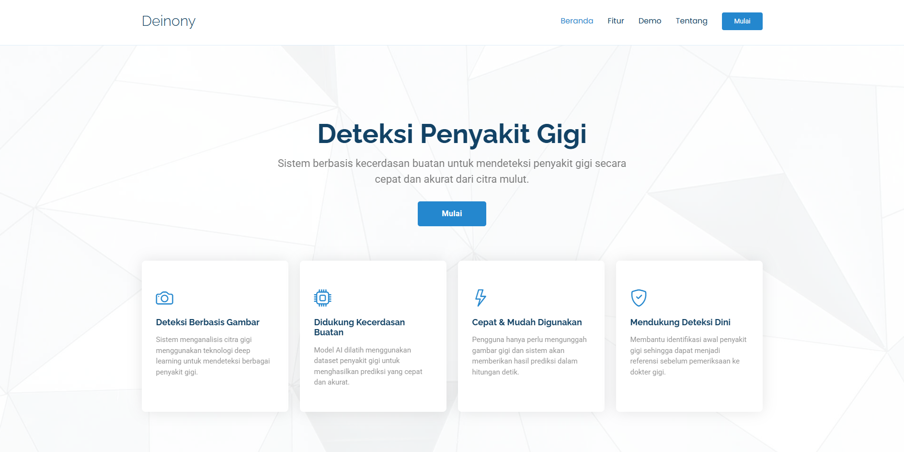
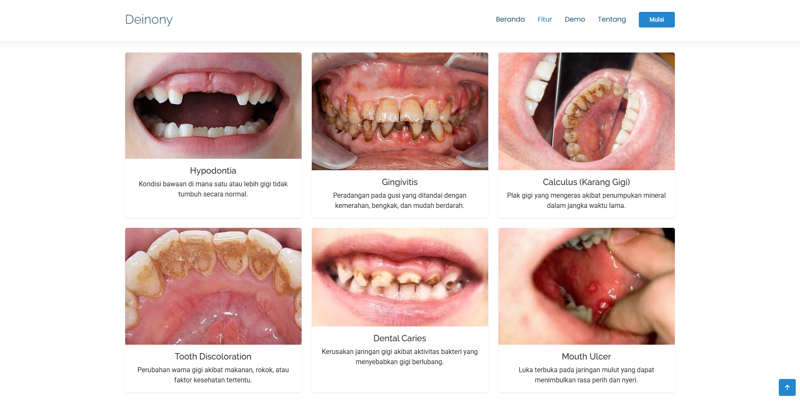
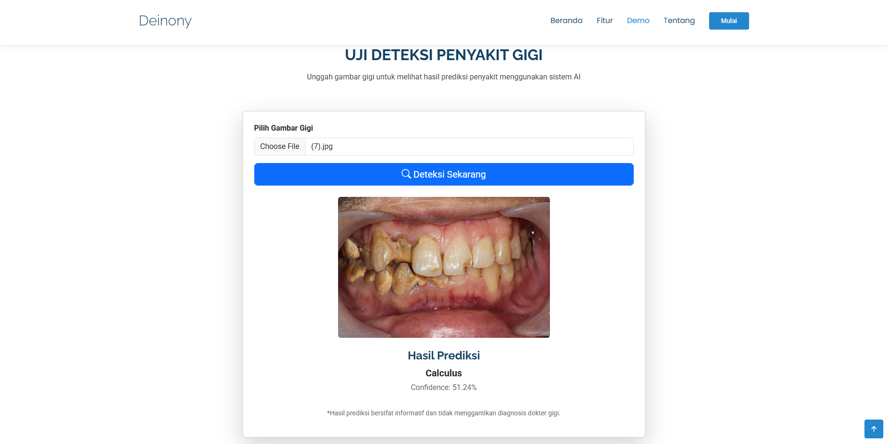

# Dental Disease Detection Application 🦷

Aplikasi ini merupakan **sistem deteksi dan klasifikasi penyakit gigi berbasis citra** menggunakan teknologi **Deep Learning**.  
Pengguna dapat mengunggah gambar gigi melalui web, kemudian sistem akan memprediksi jenis penyakit gigi beserta tingkat kepercayaannya (confidence).

Aplikasi ini dibangun menggunakan:
- **PyTorch** → training & inferensi model AI
- **Flask** → web backend
- **HTML + Bootstrap** → tampilan web

> ⚠️ Hasil prediksi bersifat informatif dan **tidak menggantikan diagnosis dokter gigi**.

---

## 📸 Tampilan Aplikasi

### Halaman Utama

### Upload Gambar Gigi

### Hasil Prediksi

---

## 🎯 Tujuan Program

Program ini bertujuan untuk:
- Mengidentifikasi penyakit gigi secara otomatis dari gambar
- Menerapkan deep learning pada bidang kesehatan gigi
- Menyediakan sistem deteksi berbasis web yang mudah digunakan

---

## 🦠 Kelas Penyakit yang Dideteksi

Model AI mampu mengklasifikasikan gambar gigi ke dalam beberapa kategori berikut:

- Calculus
- Dental Caries
- Gingivitis
- Mouth Ulcer
- Tooth Discoloration
- Hypodontia

Jumlah kelas menyesuaikan dataset yang digunakan saat proses training.

---

## ⚙️ Cara Kerja Sistem

1. Pengguna mengunggah gambar gigi melalui website
2. Sistem melakukan preprocessing gambar:
   - Resize (224 × 224)
   - Normalisasi
3. Model deep learning melakukan inferensi
4. Sistem menampilkan:
   - Nama penyakit gigi
   - Confidence prediksi (%)

---

## 🧠 Arsitektur Model

- **Base Model**: ResNet18 (Transfer Learning)
- **Framework**: PyTorch
- **Loss Function**: CrossEntropyLoss
- **Optimizer**: Adam
- **Input Image Size**: 224 × 224

Lapisan fully connected (FC) dimodifikasi agar sesuai dengan jumlah kelas penyakit gigi.

---
